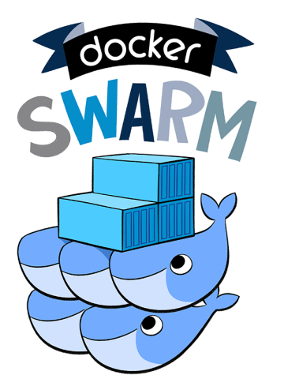
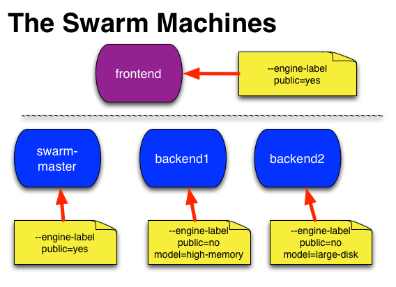
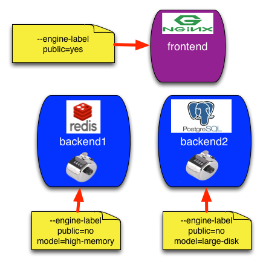
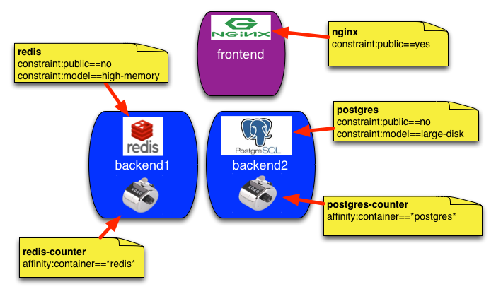

# Simple Clustering with Docker Swarm and Nginx



Bringing up your own cluster has never been easier. The [recent 1.0 release of
Docker Swarm](https://blog.docker.com/2015/11/swarm-1-0/) signals that the
Docker team feel that Swarm is ready for production.

I've been running a bunch of applications on Docker for a while now, but I have
managed the containers on the single machine level instead of as a cluster.
With the release of Swarm 1.0, I believe it is time to start clustering my
machines.

## Spinning Up the Swarm

How to spin up a Swarm for development is described well in the [Docker
documentation](http://docs.docker.com/swarm/install-w-machine/) and I'm not going
to describe it in depth here. I'll settle for the commands and extra
documentation when I feel that it may be called for.

I'm using the Swarm for development with VirtualBox here, but it is simple to
substitute any of the supported [docker-machine
providers](https://docs.docker.com/machine/drivers/).

### Create a Token

Create a token with the Docker Hub discovery service. When running this in
production you should probably setup an [alternate discovery backend](http://docs.docker.com/swarm/discovery/)
to avoid the external dependency.

```sh
# Create and save a token, using the Docker-Hub discovery service, default
$ token=$(docker run swarm create)
```

### Create a Swarm Manager

The swarm manager will be used to control the swarm. It should be protected
from access from anyone but you. I'll simulate this here by setting
`--engine-label public=no`. This is just a tag and you would have to make sure
that you setup the manager protected from public access. It is possible to use
multiple labels to tag the engine with all the qualities of this machine.

```sh
# Create a swarm manager using the token
$ docker-machine create \
  -d virtualbox \
  --swarm \
  --swarm-master \
  --swarm-discovery token://$token \
  --engine-label public=no \
  swarm-master
```

### Create a Publicly Accessible Machine

In this demo I'm only spinning up another VirtualBox machine and I'm giving it
the `--engine-label public=yes` to allow me to discover this box in the swarm.

```sh
# Create a new node named frontend and label it public
$ docker-machine create \
  -d virtualbox \
  --swarm \
  --swarm-discovery token://$token \
  --engine-label public=yes \
  frontend
```

### Create a Couple of Additional Non-Public Machines

Here I start a couple of machines with an additional `--engine-label`.
One with `model=high-memory` and one with `model=large-disk`

```sh
# Create two more nodes named backend1 and backend2, with label public=no
$ docker-machine create \
  -d virtualbox \
  --swarm \
  --swarm-discovery token://$token \
  --engine-label public=no \
  --engine-label model=high-memory \
  backend1

$ docker-machine create \
  -d virtualbox \
  --swarm \
  --swarm-discovery token://$token \
  --engine-label public=no \
  --engine-label model=large-disk \
  backend2
```

### List the Swarm



```sh
# List your machines
$ docker-machine ls
NAME           ACTIVE   DRIVER       STATE     URL                         SWARM
backend1       -        virtualbox   Running   tcp://192.168.99.103:2376   swarm-master
backend2       -        virtualbox   Running   tcp://192.168.99.104:2376   swarm-master
frontend       -        virtualbox   Running   tcp://192.168.99.102:2376   swarm-master
swarm-master   -        virtualbox   Running   tcp://192.168.99.101:2376   swarm-master (master)
```

### Connect to the Swarm

Configure the docker client to connect to it.

```sh
# List the environment needed to connect to the swarm
$ docker-machine env --swarm swarm-master
export DOCKER_TLS_VERIFY="1"
export DOCKER_HOST="tcp://192.168.99.101:3376"
export DOCKER_CERT_PATH="/Users/andersjanmyr/.docker/machine/machines/swarm-master"
export DOCKER_MACHINE_NAME="swarm-master"
# Run this command to configure your shell:
# eval "$(docker-machine env --swarm swarm-master)"

# Configure docker to use the swarm-master
$ eval $(docker-machine env --swarm swarm-master)

# List information about the cluster, output is trimmed
$ docker info
Containers: 4
Images: 4
Role: primary
Strategy: spread
Filters: health, port, dependency, affinity, constraint
Nodes: 4
 backend1: 192.168.99.103:2376
   Containers: 1
   Reserved CPUs: 0 / 1
   Reserved Memory: 0 B / 1.021 GiB
   Labels: model=high-memory, provider=virtualbox, public=no, storagedriver=aufs
 backend2: 192.168.99.104:2376
  Containers: 5
  Reserved CPUs: 0 / 1
  Reserved Memory: 0 B / 1.021 GiB
  Labels: model=large-disk, provider=virtualbox, public=no, storagedriver=aufs
 frontend: 192.168.99.102:2376
   Containers: 1
   Reserved CPUs: 0 / 1
   Reserved Memory: 0 B / 1.021 GiB
   Labels: provider=virtualbox, public=yes, storagedriver=aufs
 swarm-master: 192.168.99.101:2376
   Containers: 2
   Reserved CPUs: 0 / 1
   Reserved Memory: 0 B / 1.021 GiB
   Labels: provider=virtualbox, public=no, storagedriver=aufs
CPUs: 4
Total Memory: 4.086 GiB
Name: fa2d554280ff
```

## Starting the Containers

Now it is time to start the containers. The plan is to bring up two
database containers, Postgres and Redis, two counter web-services, and one
proxy to front the whole cluster, like this.



Alright, let's start some containers!

### Databases

According to the picture above I want to put the
[Redis](https://hub.docker.com/_/redis/) container on the machine named
`backend1`, but I don't want to address it by name, instead I'm going to target
it by its labels.

I also want to start a [Postgres](https://hub.docker.com/_/postgres/) container
on a machine with a `constraint:model==large-disk`.

### Starting Redis

```sh
# Start Redis on a non-public machine with high-memory.
$ docker run -d --name redis \
  --env constraint:public!=yes \
  --env constraint:model==high-memory \
  redis
```

In this case, `constraint:public!=yes` is not needed but I like to add it to
avoid mistakes.

#### Starting Postgres

```sh
# Start Postgres on a non-public machine with large-disk
$ docker run -d --name postgres \
  --env constraint:public!=yes \
  --env constraint:model==large-disk \
  postgres
```

If this was not a VirtualBox machine I would also mount a volume,
`-v /var/pgdata:/var/lib/postgresql/data`, for the database, but this does not work
with VirtualBox.

OK, let's see what we have.

```sh
# List running containers, output slightly trimmed
$ docker ps
CONTAINER ID     IMAGE       COMMAND                  PORTS            NAMES
aa1679b3da5c     postgres    "/docker-entrypoint.s"   5432/tcp         backend2/postgres
ffa41d90f414     redis       "/entrypoint.sh redis"   6379/tcp         backend1/redis
```

Nice, two running databases on the designated machines.

### Starting the Reverse Proxy


Nginx is one of my favorite building blocks when it comes to building reliable
web services. Nginx provides an [official Docker image](https://hub.docker.com/_/nginx/),
but in this case, when I want to automatically configure Nginx when new containers
are started, I prefer to use an alternative image called [nginx-proxy](https://github.com/jwilder/nginx-proxy).

A container started from the `nginx-proxy` image, listens to events generated
by the docker engine. The engine generates events for [all kinds of
events](http://docs.docker.com/engine/reference/api/docker_remote_api_v1.17/#monitor-dockers-events)
but all we care about here is when a container is started and stopped. If you
want to see what events are triggered from the CLI, run `docker events` in one
terminal and start and stop a few containers in another.

When `nginx-proxy` receives an event that a container has been started it checks
if the container has any ports `EXPOSE`d, if it does it also checks  for a
`VIRTUAL_HOST` environment variable. If both these conditions are fulfilled
`nginx-proxy` re-configures its Nginx server and reloads the configuration.

When you now access the `VIRTUAL_HOST`, Nginx proxies the connection to your web
service. Cool!

Naturally, you will have to configure your DNS to point to your Nginx server.
The easiest way to do this is to configure all your services to point to it
with a wildcard record. Something like this:

```sh
*.mysite.com     Host (A)    Default     xxx.xxx.xxx.xxx
```

In this case, we are using VirtualBox and we can settle for changing the
`/etc/hosts` file with the IP-number of our `frontend`.

```sh
# /etc/hosts
redis-counter.docker    192.168.99.102
postgres-counter.docker 192.168.99.102
```

**What is even more cool is that events works with Swarm** and it is possible
to use the `nginx-proxy` to listen to services that are started on different
machines. All we have to do is configure it correctly.

#### Starting Nginx-Proxy

`nginx-proxy` is started with configuration read from the docker client
environment variables. All the environments variables were automatically
configured when you configured the docker client to access the Swarm, above.

```sh
# Start nginx-proxy configured to listen to swarm events, published on port 80.
$ docker run -d --name nginx \
  -v $DOCKER_CERT_PATH:$DOCKER_CERT_PATH \
  -p "80:80" \
  --env constraint:public==yes \
  --env DOCKER_HOST \
  --env DOCKER_CERT_PATH \
  --env DOCKER_TLS_VERIFY \
   jwilder/nginx-proxy

```

OK, we are almost done. Now it is time to start the web services.

### Starting Web Services

As a web service I'm going to use a [simple counter image](https://hub.docker.com/r/andersjanmyr/counter/) since it can use both Postgres and Redis as backend.
I want to start the web services on the same server as the databases since this
allows me to use `--link` to connect to the container and it will speed up the
data access. To do this I can use an affinity constraint: `--env
affinity:container==*redis*`.

```sh
# Start a counter close to the container named redis and link to it.
$ docker run -d --name redis-counter \
  -p 80 \
  --link redis \
  --env affinity:container==*redis* \
  --env REDIS_URL=redis:6379 \
  --env VIRTUAL_HOST=redis-counter.docker \
  andersjanmyr/counter
```

The affinity constraint is not really necessary since affinity constraints are
automatically generated by Swarm when `--link` is present as you can see when
we start the  `postgres-counter`.

```sh
# Start a counter close to the container named postgres and link to it.
$ docker run -d --name postgres-counter \
  -p 80 \
  --link postgres \
  --env POSTGRES_URL=postgres://postgres@postgres \
  --env VIRTUAL_HOST=postgres-counter.docker \
  andersjanmyr/counter
```

Browse to [http://redis-counter.docker](http://redis-counter.docker) or
[http:/postgres-counter.docker](http:/postgres-counter.docker) and
you should see your services up and running.


## Summary

Here's an illustration of our current setup:



And here is a listing of all the containers on their respective machines.
```sh
$ docker ps
CONTAINER ID        IMAGE                  COMMAND                  PORTS                                NAMES
b3869a89e76c        andersjanmyr/counter   "/counter-linux"         192.168.99.104:32768->80/tcp         backend2/postgres-counter
cff69b6f970d        andersjanmyr/counter   "/counter-linux"         192.168.99.103:32768->80/tcp         backend1/redis-counter
64af31135c26        jwilder/nginx-proxy    "/app/docker-entrypoi"   443/tcp, 192.168.99.102:80->80/tcp   frontend/nginx
aa1679b3da5c        postgres               "/docker-entrypoint.s"   5432/tcp                             backend2/postgres,backend2/postgres-counter/postgres
ffa41d90f414        redis                  "/entrypoint.sh redis"   6379/tcp                             backend1/redis,backend1/redis-counter/redis
```

May the Swarm be with you! :D

